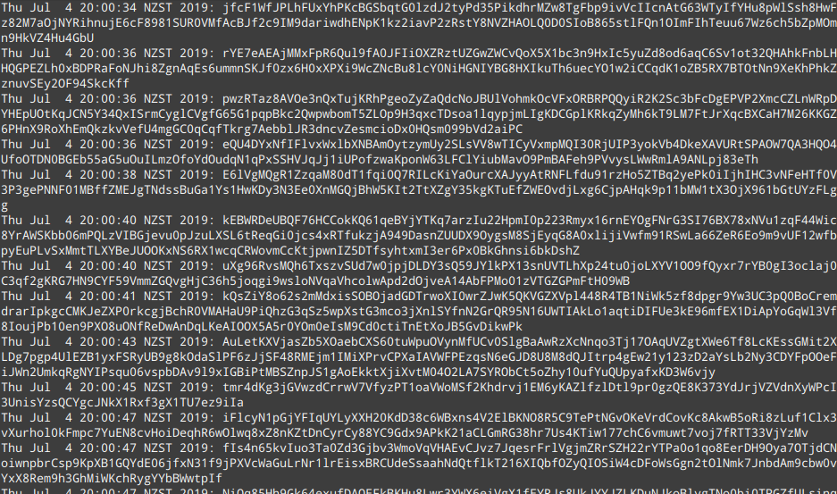
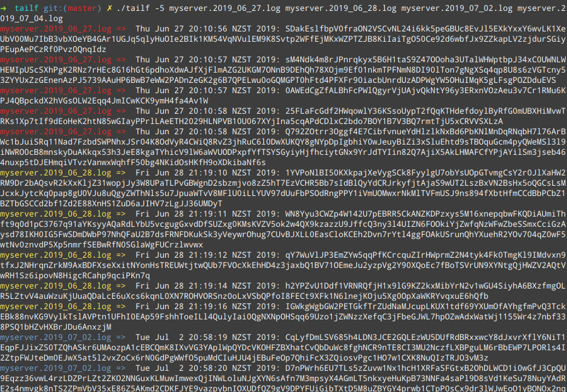

# Tail implemented with Go 

.. for the thousandth time.. 

not for production, not supported, yada yada

Based on the wonderful talk done by Fabian Stäber at [Implementing 'tail -f' in Go](https://www.youtube.com/watch?v=lLDWF59aZAo)

Binary compressed with [UPX](https://upx.github.io/).

## What's special about this?
Nothing really. It can tail multiple files at once (which is cool I guess) and will work with logrotation (for all your servers that have timezones set to UTC). Guaranteed to be slower than GNU `tail`. More than 7x larger in file size.  

## Compatibility
Works only on Linux, tested only on Ubuntu with an 88/256 compatible terminal

## Usage
#### Tail a single file, starting with the last 5 lines
```bash
$ tailf -5 someserver.log
```


#### Tail multiple files
```bash
$ tailf someserver.log someserver-access.log someserver-error.log
```
When tailing multiple files, the filename will be prefixed to the output



## License
Apache v2 
